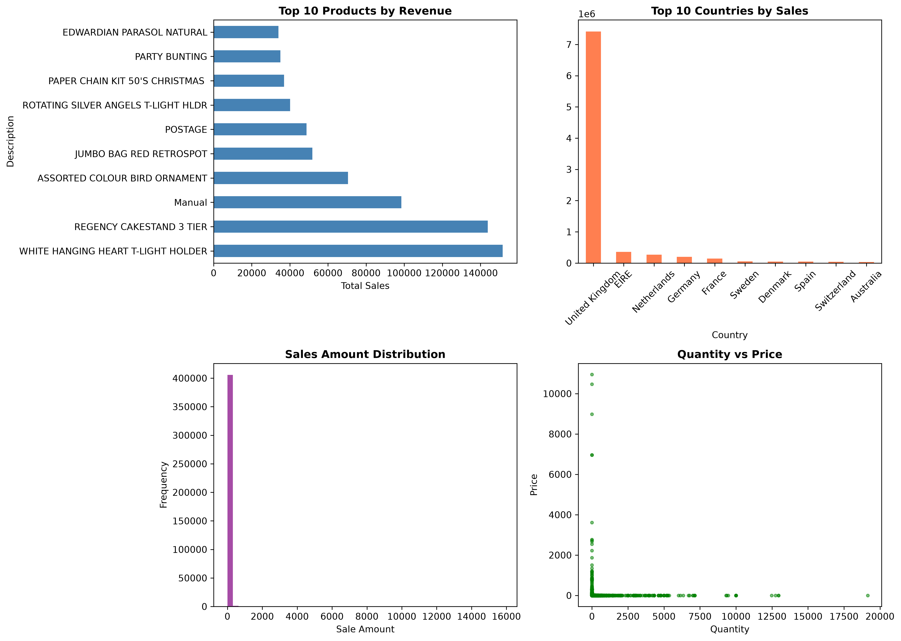

# Sales Data Analysis Project

## Overview
Analyzed **525,461 online retail transactions** to uncover sales trends, identify top-performing products, evaluate country-wise revenue, and generate business insights using Python.

## Dataset
- Dataset: Online Retail
- Records: 525,461
- Format: Excel (.xlsx)

## Objectives
- Clean and preprocess raw sales data
- Identify top-selling products
- Analyze country-wise revenue
- Visualize sales patterns
- Generate actionable business insights

## Data Cleaning
- Removed 18,000+ rows with missing values
- Removed cancelled and returned orders
- Removed records with zero price
- Created a clean dataset with 507,000+ valid transactions

## Analysis Performed
- Top 10 products by revenue
- Top 10 countries by sales
- Sales distribution analysis
- Quantity vs Unit Price relationship

## Visualizations
- Top 10 Products by Revenue
- Top 10 Countries by Sales
- Sales Distribution Histogram
- Quantity vs Unit Price Scatter Plot

## Key Findings
- White-themed products generated significant revenue.
- The United Kingdom was the highest revenue-generating market.
- Most transactions were in the lower price range.
- Large order quantities did not always result in higher revenue.

## Tools & Technologies
- Python
- Pandas
- Matplotlib
- OpenPyXL
- Microsoft Excel

## Project Structure
```
Sales-Data-Analysis/
│── analysis.py
│── Online Retail.xlsx
│── sales_analysis.png
│── README.md
```

## Project Screenshot



## How to Run

1. Install the required libraries:
   ```bash
   pip install pandas matplotlib openpyxl
   ```

2. Run the project:
   ```bash
   python3 analysis.py
   ```

## Skills Demonstrated
- Data Cleaning
- Exploratory Data Analysis (EDA)
- Data Visualization
- Business Insight Generation
- Python Programming
- Data Aggregation
- Problem Solving

## Author

**Shagun Gupta**

Aspiring Data Analyst | Python | SQL | Excel | Power BI